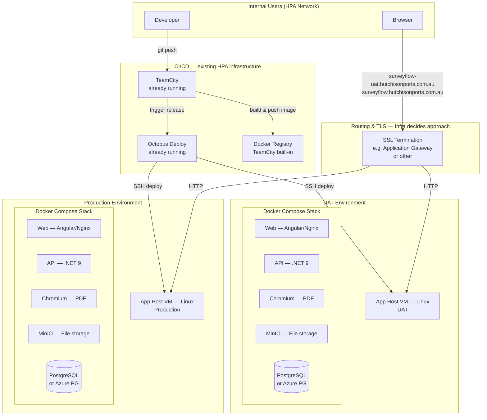
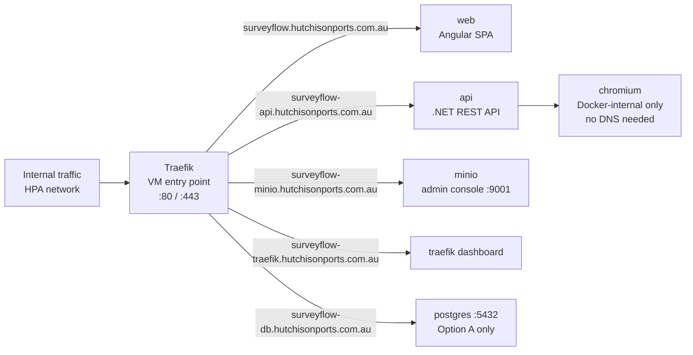
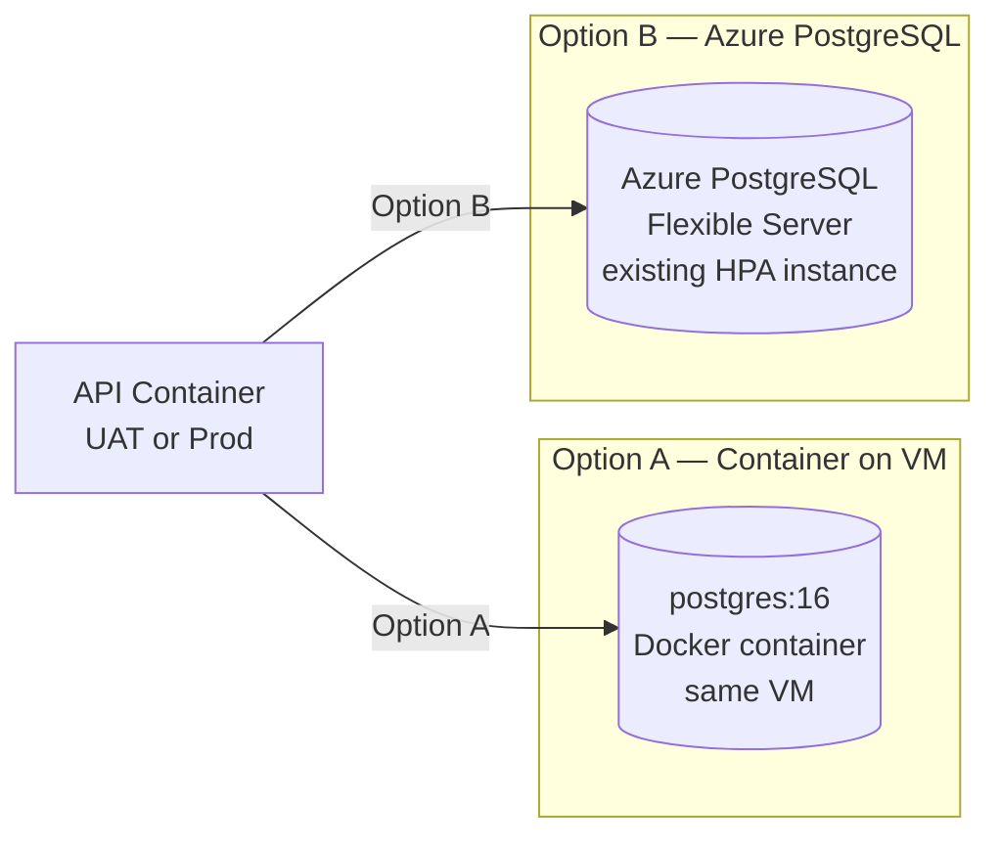

# Infrastructure Request — HPA SurveyFlow

**From:** HPA Development Team  
**To:** Infrastructure Team  
**Date:** 2026-05-26  
**Priority:** Normal  
**App:** HPA SurveyFlow (Internal)

---

## Overview

We are deploying a new **internal web application** called **HPA SurveyFlow** — a form-building and survey management tool for internal HPA use. The application is fully containerised (Docker Compose) and requires two environments: **UAT** and **Production**.

We will be using **TeamCity** for builds and **Octopus Deploy** for release management. Both tools are already provisioned and running within HPA infrastructure — we just need to configure them for this project. **No new CI/CD servers are required from Infra.**

How traffic reaches the VMs (e.g. via Application Gateway, load balancer, direct DNS, or another method) is entirely Infra's decision. We just need the app to be accessible over HTTPS on the hostnames listed below. This document describes everything we need from Infra to make that happen.

---

## Architecture Overview

---

## Environments

We need **two separate environments**, each on its own VM with its own DNS entry and SSL certificate.

| Environment | Proposed hostname | Purpose |
|---|---|---|
| UAT | `surveyflow-uat.hutchisonports.com.au` | Testing and acceptance |
| Production | `surveyflow.hutchisonports.com.au` | Live internal use |

> Both hostnames follow the `.hutchisonports.com.au` domain. Please advise if a different subdomain convention is preferred (e.g. `uat-surveyflow`, `surveyflow-uat`, etc.).

---

## Application Containers

The same Docker Compose stack runs in both environments. All containers are on a single host VM per environment.

| Container | Image | Purpose | Internal port |
|---|---|---|---|
| `web` | Custom (Angular/Nginx) | Frontend SPA + API reverse proxy | 80 |
| `api` | Custom (.NET 9 ASP.NET Core) | Backend REST API | 5000 |
| `traefik` | `traefik:v3.3` | Internal reverse proxy on the VM | 80, 443 |
| `chromium` | `browserless/chrome` | Headless browser for PDF export | 3000 |
| `minio` | `minio/minio` | S3-compatible file/upload storage | 9000 |
| `postgres` | `postgres:16` | Relational database (Option A) | 5432 |

Traefik on each VM routes by hostname between the `web` and `api` containers. External traffic only needs to reach the VM on port 80 (if TLS is terminated upstream) or 443 (if TLS is terminated at Traefik).

---

## What We Need from Infra

### 1. Application Host VMs (× 2)

One VM per environment (UAT and Production), both Linux.

| | UAT VM | Production VM |
|---|---|---|
| **OS** | Red Hat Enterprise Linux (preferred) or Infra's standard Linux distro | Red Hat Enterprise Linux (preferred) or Infra's standard Linux distro |
| **Min spec** | 2 vCPU / 4 GB RAM / 40 GB disk | 4 vCPU / 8 GB RAM / 120 GB disk |
| **Software** | Docker + Docker Compose | Docker + Docker Compose |
| **Network** | Internal only, outbound internet for image pulls | Internal only, outbound internet for image pulls |

### 2. DNS Records

All DNS records point to the same VM (or whatever upstream device Infra places in front of it). Traefik on the VM then routes each hostname to the correct container.

**Services that need a DNS record** are any with a browser-accessible UI or an externally consumed endpoint. **Chromium has no UI and is internal-only** — it needs no DNS record.

> Note: PostgreSQL, MinIO, and Traefik admin dashboard are only needed on the **Production VM** for day-to-day operations. We also want them on **UAT** for testing and administration.

#### UAT environment

| Hostname | Points to | Purpose |
|---|---|---|
| `surveyflow-uat.hutchisonports.com.au` | UAT VM (via routing) | Frontend SPA |
| `surveyflow-uat-api.hutchisonports.com.au` | UAT VM (via routing) | Backend REST API |
| `surveyflow-uat-minio.hutchisonports.com.au` | UAT VM (via routing) | MinIO admin console (:9001) |
| `surveyflow-uat-traefik.hutchisonports.com.au` | UAT VM (via routing) | Traefik dashboard |
| `surveyflow-uat-db.hutchisonports.com.au` | UAT VM (via routing) | PostgreSQL — only if Option A (container on VM) |
| `surveyflow-uat-vm.hutchisonports.com.au` | UAT VM IP (direct A record) | VM machine name — required for Octopus Tentacle registration |

#### Production environment

| Hostname | Points to | Purpose |
|---|---|---|
| `surveyflow.hutchisonports.com.au` | Prod VM (via routing) | Frontend SPA |
| `surveyflow-api.hutchisonports.com.au` | Prod VM (via routing) | Backend REST API |
| `surveyflow-minio.hutchisonports.com.au` | Prod VM (via routing) | MinIO admin console (:9001) |
| `surveyflow-traefik.hutchisonports.com.au` | Prod VM (via routing) | Traefik dashboard |
| `surveyflow-db.hutchisonports.com.au` | Prod VM (via routing) | PostgreSQL — only if Option A (container on VM) |
| `surveyflow-prod-vm.hutchisonports.com.au` | Prod VM IP (direct A record) | VM machine name — required for Octopus Tentacle registration |

> PostgreSQL does not have a browser UI — its hostname is for direct client tool access (e.g. pgAdmin, DBeaver) from within the HPA network. If Option B (Azure PostgreSQL) is chosen, the `*-db` records are not needed.

> All proposed hostnames are placeholders — please advise if a different naming convention is preferred.

> UAT hostnames follow the same pattern with `-uat` inserted, e.g. `surveyflow-uat.hutchisonports.com.au`, `surveyflow-uat-api.hutchisonports.com.au`, etc.

### 3. SSL Certificates

We need an individual SSL certificate per hostname — **one certificate per URL listed in the DNS tables above**. We understand wildcard certificates are not used at HPA.

Certificates should be provisioned by Infra and can be applied either:
- At an upstream device (e.g. Application Gateway) — Traefik receives plain HTTP
- On the VM, provided to the dev team to configure in Traefik — Traefik terminates TLS directly

**Please advise on the preferred approach.** The total number of certificates required is:

| Environment | Certificate count | Notes |
|---|---|---|
| UAT | 4 (or 5 if PostgreSQL on VM) | One per hostname above |
| Production | 4 (or 5 if PostgreSQL on VM) | One per hostname above |

### 4. Routing

How traffic reaches each VM is Infra's decision (Application Gateway, direct DNS, NAT, etc.). The VM runs **Traefik** which listens on both **port 80 and port 443** and handles all internal hostname-based routing to the correct container. We only require:

- Traffic on **port 80** and/or **port 443** is routed to the correct VM for each environment
- If TLS is terminated upstream (e.g. at an Application Gateway), Infra forwards plain HTTP to the VM on port 80 — Traefik handles it from there
- If TLS is terminated on the VM, Infra provides the SSL certificate and we configure Traefik to serve HTTPS on port 443 directly

Both approaches are supported — Infra chooses whichever fits the existing network setup.

### 5. Firewall Rules

| Rule | Source | Destination | Port | Purpose |
|---|---|---|---|---|
| Octopus → UAT VM | Octopus Deploy server | UAT App Host VM | 10933 | Octopus Tentacle — deployments |
| Octopus → Prod VM | Octopus Deploy server | Prod App Host VM | 10933 | Octopus Tentacle — deployments |
| UAT VM → Mail server | UAT App Host VM | HPA mail server | 25 or 587 | Outbound email from the application |
| Prod VM → Mail server | Prod App Host VM | HPA mail server | 25 or 587 | Outbound email from the application |

> Please provide the **hostname and port of the HPA mail server** (SMTP relay) so we can configure it in the application.

---

## Database — Decision Needed

We have two options for PostgreSQL. The same decision applies to both environments.

| | Option A — PostgreSQL container on VM | Option B — Azure PostgreSQL Flexible Server |
|---|---|---|
| **Cost** | No additional cost | Additional DB cost, or add to existing instance |
| **Managed backups** | Manual / we configure | Azure-managed backups |
| **HA / failover** | Single point of failure | Built-in HA options |
| **Setup effort for Infra** | None | Create DB + firewall rule, provide connection string |
| **Our preference** | Simpler for initial rollout | Better long-term resilience |

> If HPA already has an Azure PostgreSQL Flexible Server, we would prefer to add two databases (`surveyflow_uat` and `surveyflow_prod`) to it. Otherwise we are happy with Option A.

---

## File Storage (MinIO)

MinIO runs as a container on each VM and acts as an S3-compatible object store for file uploads. Only the API container communicates with it over the internal Docker network — no external access is required.

The application is also capable of using **Azure Blob Storage** as a drop-in replacement if the company prefers a managed storage solution. If this is the preferred direction, Infra would need to provision a storage account and provide the connection details, and we will reconfigure the application accordingly. Otherwise, MinIO on the VM requires no Infra involvement.

---

## CI/CD Pipeline

The CI/CD pipeline is fully managed by the development team. **Infra does not need to know about or do anything with these tools**, except open port 10933 on each App Host VM so the Octopus Tentacle agent can communicate with the Octopus server.

The pipeline works as follows — all of this is already set up or will be configured by the dev team:
1. Code is hosted on **GitHub** — a push to `main` automatically triggers a TeamCity build
2. **TeamCity** builds the Docker image and pushes it to the Octopus built-in package feed
3. **Octopus Deploy** deploys the package to the target VM via the Octopus Tentacle agent

The Tentacle agent will be installed and registered on each VM by the development team after the VMs are provisioned.

### What we need from Infra for CI/CD
- **Firewall rule**: Octopus Deploy server → UAT VM on **port 10933** (Octopus Tentacle)
- **Firewall rule**: Octopus Deploy server → Production VM on **port 10933** (Octopus Tentacle)

---

## Summary of All Actions Requested from Infra

| # | Action | Env | Owner | Notes |
|---|---|---|---|---|
| 1 | Provision App Host VM (Linux) | UAT | Infra | 2 vCPU / 4 GB / 40 GB, Docker + Compose |
| 2 | Provision App Host VM (Linux) | Production | Infra | 4 vCPU / 8 GB / 120 GB, Docker + Compose |
| 3 | DNS record — `surveyflow-uat.hutchisonports.com.au` | UAT | Infra | Points to UAT VM or upstream |
| 4 | DNS record — `surveyflow.hutchisonports.com.au` | Production | Infra | Points to Prod VM or upstream |
| 5 | SSL certificate — UAT hostname | UAT | Infra | Advise on approach (wildcard, individual, internal CA) |
| 6 | SSL certificate — Production hostname | Production | Infra | Same approach as UAT |
| 7 | Configure routing to App Host VMs (port 80 and/or 443) | Both | Infra | Infra decides mechanism — Traefik on the VM handles the rest |
| 8 | Firewall: Octopus VM → UAT VM port 10933 | UAT | Infra | Octopus Tentacle — dev team installs Tentacle on VM |
| 9 | Firewall: Octopus VM → Prod VM port 10933 | Production | Infra | Octopus Tentacle — dev team installs Tentacle on VM |
| 10 | Firewall: UAT VM → HPA mail server (SMTP) | UAT | Infra | Outbound email from the application |
| 11 | Firewall: Prod VM → HPA mail server (SMTP) | Production | Infra | Outbound email from the application |
| 12 | Database decision — PostgreSQL container vs Azure PG | Both | Infra + Dev | Two DBs needed: `surveyflow_uat` and `surveyflow_prod` |

---

## Questions for Infra

1. Is the proposed hostname convention acceptable (`surveyflow-uat` / `surveyflow`), or is there a preferred naming pattern for UAT environments?
2. What is the preferred SSL approach — wildcard certificate, per-hostname, or internal CA?
3. Is there an existing Azure PostgreSQL Flexible Server we can add databases to?
4. What is the hostname and port of the HPA SMTP relay so we can configure outbound email in the application?

---

*Please reach out to the development team with any questions or to align on the decisions above.*
