# UI QA Audit — SurveyFlow Admin

Generated: 2026-06-01
Crawler run: 2026-05-31T21:46:17.773Z

---

## Audit Scope

| Item | Value |
|------|-------|
| Base URL | http://localhost:4200 |
| Breakpoints tested | mobile-375, tablet-768, desktop-1024, desktop-1440 |
| Routes discovered | 23 |
| Routes visited | 23 |
| Routes failed/skipped | 0 |
| Axe enabled | Yes |
| Coverage gaps | None — all 23 routes visited successfully |

---

## Executive Summary

The application is visually polished and structurally complete — all 23 routes loaded without errors and the overall layout is clean and consistent. The primary risks are accessibility and mobile responsiveness: 65 axe violations were found across every page (8 critical, 18 serious), driven by three systemic patterns — missing `<main>` landmarks, unlabelled form controls, and insufficient colour contrast on `text-gray-400` spans. Mobile (375px) is the weakest breakpoint: tables on Forms, Categories, Submissions, Users, Synced Data, and Logs overflow the viewport because they lack `overflow-x-auto` wrappers, and touch targets on nav links and row action buttons are below 36px on every admin page. A secondary consistency issue is that the "Delete" button style varies between pages (`text-red` on Forms vs `border-red` on Categories, Submissions, and Users). Fixing the three systemic accessibility patterns and wrapping tables in `overflow-x-auto` would resolve the majority of findings in a single pass.

---

## Top 10 Fixes in Recommended Order

1. **Add `<main>` landmark to shell layout** — fixes `landmark-one-main` and `region` violations across all 23 pages in one change.
2. **Add `aria-label` / `<label>` to unlabelled `<select>` and `<input type="date">` controls** — fixes 8 critical violations on Submissions, Reports, Synced Data, Logs, Audit Log.
3. **Add `aria-label` to unlabelled file input on Profile** — fixes 8 critical violations on the profile page.
4. **Increase contrast of `.text-gray-400` spans** — replace with `text-gray-500` minimum; fixes serious violations site-wide.
5. **Wrap all `<table>` elements in `overflow-x-auto` containers** — fixes mobile overflow on Forms, Categories, Submissions, Users, Synced Data, Logs.
6. **Standardise destructive action button style** — use `border-red-200 bg-red-50 text-red-700` outline everywhere; currently `text-red` on Forms vs `border-red` on others.
7. **Increase touch target heights to ≥ 44px** for sidebar nav links and table row action buttons at mobile breakpoints.
8. **Add `srcset` / responsive `` sizing to form thumbnail images** — resolves NG0913 warnings on Forms and Category Pre-Start.
9. **Add a "Create API Key" CTA inside the API Keys empty state** — only page with an empty state but no action button.
10. **Add `<h1>` to the Category Pre-Start public page** — currently no level-one heading, failing `page-has-heading-one` axe rule.

---

## Critical / High Priority Findings

**F-001 — Missing `<main>` landmark on every page**
- Severity: High
- Type: Accessibility
- Affected routes: All 23 pages
- Evidence: `landmark-one-main` violation (moderate) and `region` violation (3–105 elements per page) found on every page
- Recommendation: Wrap the content area in `<main>` in the root shell component. Single template change that resolves the two most-repeated axe rules across the entire app.

**Screenshot evidence**

Not available — landmark absence is not visually observable in screenshots.

---

**F-002 — Unlabelled `<select>` controls on filter bars**
- Severity: Critical
- Type: Accessibility
- Affected routes: `/admin/submissions`, `/admin/reports`, `/admin/synced-data`, `/admin/logs`, `/admin/audit-log`
- Evidence: `select-name` critical violation — 10 selects total (3 on Reports, 3 on Logs, 2 on Synced Data, 1 each on Submissions and Audit Log). Example selectors: `select`, `select[ng-reflect-model=""]`, `.w-48`
- Recommendation: Add `aria-label` or a visually hidden `<label>` to every `<select>`. Use `aria-label="Filter by form"`, `aria-label="Log level"` etc.

**Screenshot evidence**

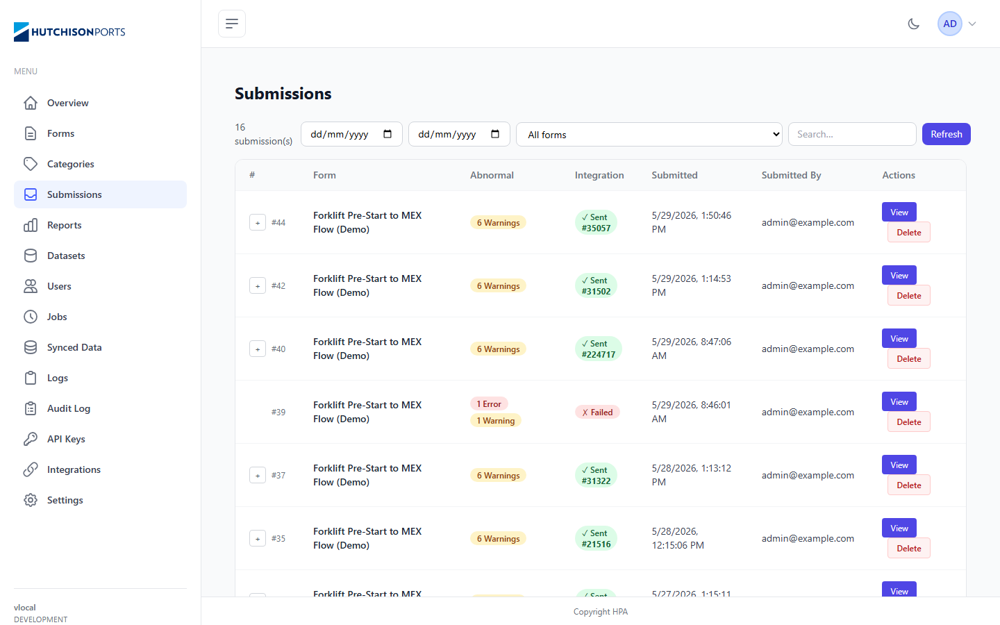

_Desktop 1440px — the date pickers, form-filter select, and search input in the Submissions filter bar have no associated labels._

---

**F-003 — Unlabelled date inputs on filter bars**
- Severity: Critical
- Type: Accessibility
- Affected routes: `/admin/submissions`, `/admin/audit-log`
- Evidence: `label` critical violation — `input[type="date"]:nth-child(1)`, `div:nth-child(3) > input[type="date"]`
- Recommendation: Add `<label>` elements (visually hidden if needed) or `aria-label="From date"` / `aria-label="To date"` to each date range input pair.

**Screenshot evidence**

Not available — same screenshot as F-002 covers this; label absence is not visually distinguishable.

---

**F-004 — Unlabelled file input on Profile page**
- Severity: Critical
- Type: Accessibility
- Affected routes: `/admin/profile`
- Evidence: `label` critical violation — `input[type="file"]`, 8 affected elements
- Recommendation: Add explicit `<label for="...">` or `aria-label="Upload profile avatar"` to the file upload control.

**Screenshot evidence**

Not available from crawler output.

---

**F-005 — Tables overflow viewport on mobile (375px) — missing scroll wrapper**
- Severity: High
- Type: Responsive
- Affected routes: `/admin/forms`, `/admin/categories`, `/admin/submissions`, `/admin/users`, `/admin/synced-data`, `/admin/logs`
- Evidence: `table.min-w-full` overflows viewport at 375px on all six pages — right-hand columns (Actions, Anonymous, Public URL) are cut off and row actions are unreachable
- Recommendation: Wrap every `<table>` with `<div class="overflow-x-auto">`.

**Screenshot evidence**

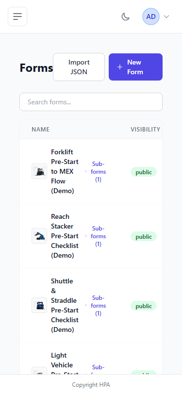

_375px mobile — the Forms table clips horizontally. The ANONYMOUS and ACTIONS columns are cut off; Delete/Edit/Export buttons are unreachable without scrolling._

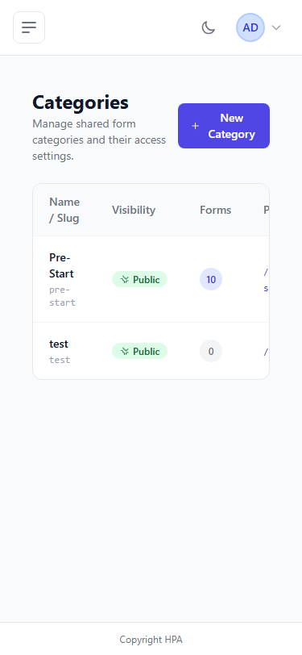

_375px mobile — the Categories table clips. The Public URL and Actions columns are not visible._

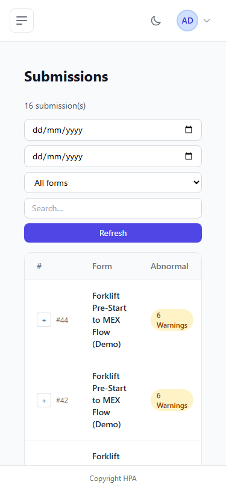

_375px mobile — the Submissions table clips. Integration status, date, and Actions columns are cut off. The filter bar stacks vertically but the table still needs `overflow-x-auto`._

---

**F-006 — Submissions filter bar overflows at tablet (768px) and desktop (1024px)**
- Severity: High
- Type: Responsive
- Affected routes: `/admin/submissions`
- Evidence: `select.rounded-lg`, `input.rounded-lg`, `button.rounded-lg` overflow viewport at both 768px and 1024px
- Recommendation: Use `flex-wrap gap-2` on the filter row or convert to a two-row layout at narrower breakpoints.

**Screenshot evidence**

Not available from crawler output.

---

**F-007 — Low colour contrast on `.text-gray-400` spans (site-wide)**
- Severity: High (axe `serious`)
- Type: Accessibility
- Affected routes: 15+ pages — every page with card subtitles, sidebar labels, or count badges
- Evidence: `color-contrast` serious violation — `.text-gray-400 > span`, `h2 > span`, `.mb-4.leading-5 > span`; worst case: 41 elements on Logs, 20 on Reports, 13 on Datasets
- Recommendation: Replace `text-gray-400` with `text-gray-500` for body/secondary text on white or light-gray backgrounds.

**Screenshot evidence**

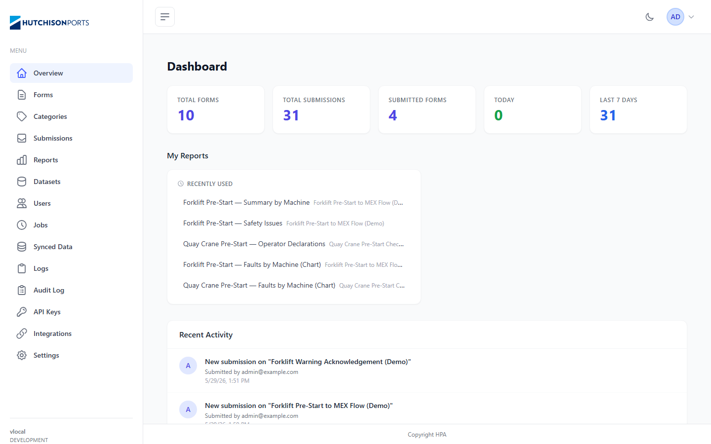

_Desktop 1440px — card subheadings and sidebar section labels use `text-gray-400` which fails WCAG AA contrast. Most visible on "MENU" label and card stat subtitles._

---

**F-008 — 25 console warnings for oversized seed images**
- Severity: High
- Type: Functional / Performance
- Affected routes: `/admin/forms`, `/category/pre-start`
- Evidence: `NG0913: An image with src .../seed/Forklift.png has intrinsic file dimensions much larger than its rendered size` — 20 warnings on Forms (one per breakpoint × 5 images), 5 on Category Pre-Start
- Recommendation: Add `width` and `height` attributes to `` tags serving thumbnails, or use Angular's `NgOptimizedImage`. Alternatively generate thumbnails server-side.

**Screenshot evidence**

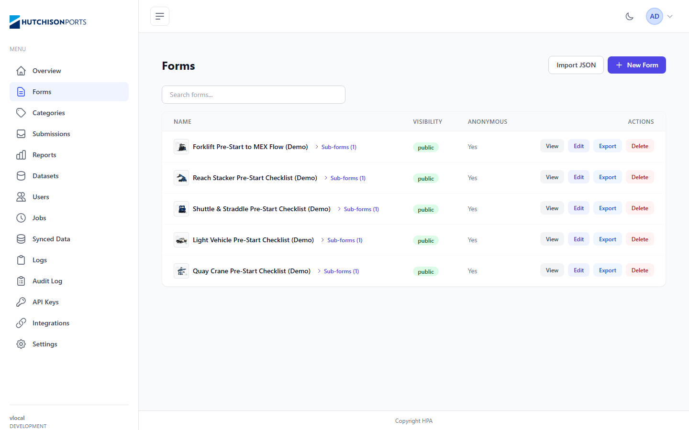

_Desktop 1440px — each row has a small thumbnail (≈40×40px) served from the full-resolution seed image (original dimensions much larger), triggering NG0913 warnings._

---

## Cross-Page Consistency Findings

### Destructive action button styles — inconsistent

Two different styles in use across pages with delete actions:

- **Forms**: plain `text-red-600` text link — "Delete"
- **Categories, Submissions, Users**: `border-red` outlined button — "Delete"


_Forms page uses a plain text "Delete" link (right column). Categories and Users use an outlined red button. Standardise to the outlined style._

Recommendation: Use `border-red-200 bg-red-50 text-red-700 hover:bg-red-100` outlined style everywhere. Plain text links are easier to click accidentally.

### Breadcrumbs — absent site-wide

No page has breadcrumbs. Acceptable for the single-level admin hierarchy, but the public category page (`/category/pre-start`) has no navigation aid back to the home listing.

### Save button location — inconsistent across form pages

| Page | Save placement |
|------|---------------|
| Settings | Top-right |
| Integrations | Top-right |
| Profile | Bottom of form |

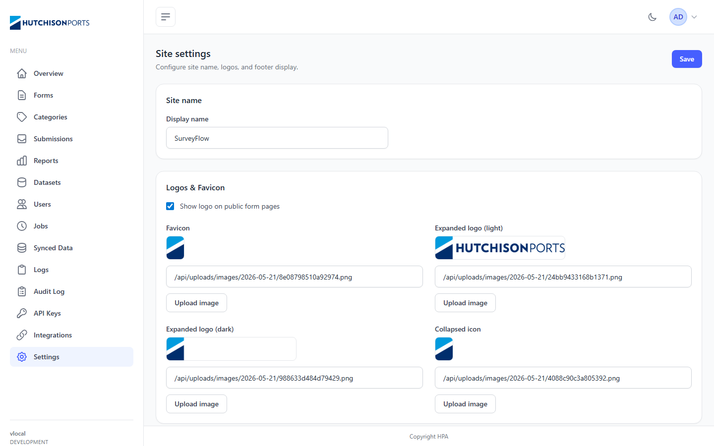

_Settings places Save top-right. Profile places "Save changes" at the bottom of the form. Standardise to top-right sticky save for all admin form pages._

### Table density — inconsistent

| Page | Density |
|------|---------|
| Forms | Standard |
| Categories | Loose |
| Submissions | Compact |
| Users | Standard |
| Synced Data | Loose |
| Logs | Compact |

Three distinct densities in use. Recommend a single standard density for admin tables; compact only for high-volume log/audit views.

### Table row action labels — mixed text and icon patterns

- Synced Data uses `▸` (chevron icon) alongside "Details" text buttons.
- Jobs uses `▶ Run Now` with an emoji-style glyph.

Recommend: use text labels only for all table row actions. Reserve icons for icon-only ghost buttons, always with `aria-label`.

### Empty state patterns

Only the API Keys page has a proper empty state (`"No API keys yet."`), but without a CTA button. Reports, Datasets, Audit Log show nothing when empty.

---

## Responsive Findings

### Mobile (375px)


_Login page at 375px — 4 touch targets below 36px ("View all" links at the bottom of category cards)._

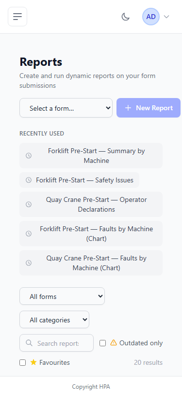

_Reports at 375px — filter/tab buttons overflow the viewport (82 touch targets below minimum size)._

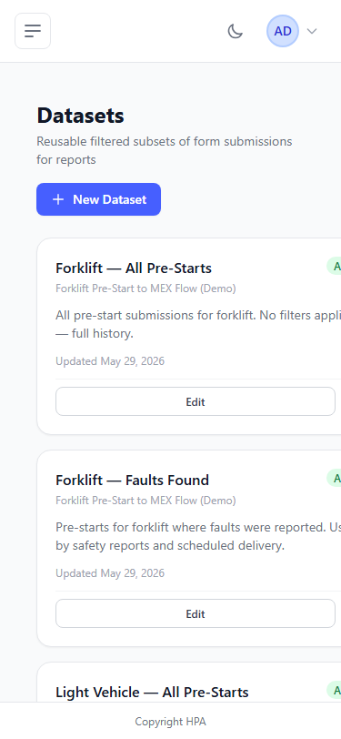

_Datasets at 375px — inline-flex action buttons overflow. 21 touch targets below minimum size._

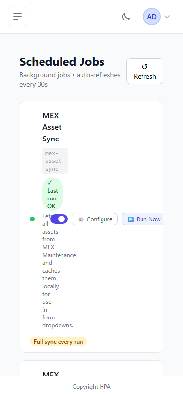

_Jobs at 375px — job card action buttons (`button.px-2.5`) overflow. 9 touch targets below minimum size._

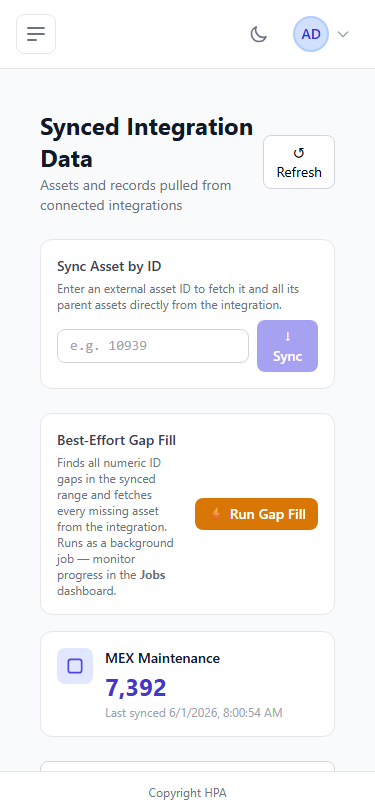

_Synced Data at 375px — table and action buttons overflow. 9 touch targets below minimum size._

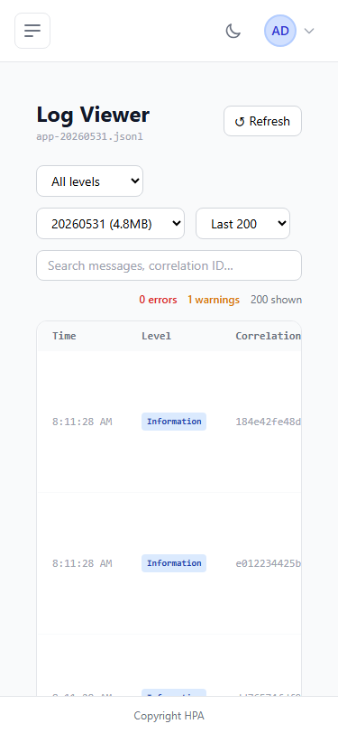

_Logs at 375px — compact table overflows horizontally._

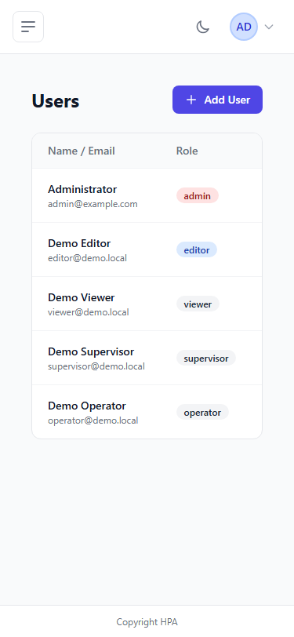

_Users at 375px — table overflows, 11 touch targets below minimum. Edit/Delete buttons cut off._

**Summary of mobile-375 issues:**

| Page | Table overflow | Touch targets < 36px |
|------|---------------|----------------------|
| Login / Public Home | — | 4 each |
| Forms | Yes | 21 |
| Categories | Yes | 7 |
| Submissions | Yes | 51 |
| Reports | — | 82 |
| Datasets | — | 21 |
| Users | Yes | 11 |
| Jobs | — | 9 |
| Synced Data | Yes | 9 |
| Logs | Yes | — |

### Tablet (768px)

- **Submissions filter bar overflow**: The date + select + search + Refresh row exceeds 768px width.
- **Forms table overflow**: `table.min-w-full` overflows at 768px within the sidebar layout.

### Desktop (1024px)

- **Submissions filter bar overflow**: Same filter row issue persists at 1024px.
- **Forms table overflow**: Still overflows at 1024px — column widths exceed available content width within the sidebar layout.

### Large Desktop (1440px)

No overflow or layout issues. All pages render correctly.


_Dashboard at 1440px — layout, sidebar, stat cards, and recent activity all render correctly._

---

## Accessibility Findings

### Critical — Missing form labels

| Rule | Severity | Pages | Affected elements | Example selector |
|------|----------|-------|-------------------|------------------|
| `select-name` | Critical | Submissions, Reports, Synced Data, Logs, Audit Log | 10 selects | `select[ng-reflect-model=""]` |
| `label` | Critical | Submissions, Audit Log | 4 date inputs | `input[type="date"]:nth-child(1)` |
| `label` | Critical | Profile | 8 file inputs | `input[type="file"]` |

Fix: Add `aria-label` or `<label>` to every bare `<select>` and `<input>` in filter bars and the profile avatar uploader.

### Serious — Colour contrast (all pages)

| Rule | Severity | Worst affected | Elements |
|------|----------|----------------|---------|
| `color-contrast` | Serious | Logs (41), Reports (20), Datasets (13) | `h2 > span`, `.text-gray-400 > span` |

Replace `text-gray-400` with `text-gray-500` or darker for all secondary/body text.

### Moderate — Missing `<main>` landmark (all pages)

| Rule | Affected pages | Element count |
|------|---------------|--------------|
| `landmark-one-main` | 23/23 | 1 per page |
| `region` | 23/23 | 3–105 per page |

Adding `<main>` to the shell layout resolves both rules globally.

### Moderate — Heading order (Datasets)

Rule `heading-order` — a card title uses a heading level that skips the document sequence. Ensure dataset card headings follow the page `<h1>` in order.

### Minor — Empty table header (Synced Data)

Rule `empty-table-header` — the actions column `<th>` (`.w-20:nth-child(6)`) has no text. Add `scope="col"` and `aria-label="Actions"`.

### Moderate — Missing `<h1>` on Category Pre-Start public page

Rule `page-has-heading-one` — the public category listing page has no `<h1>`. Add a visible or visually-hidden `<h1>` with the category name.

---

## Page-Specific Findings

### `/category/pre-start` — Public category page

- No `<h1>` heading (`page-has-heading-one` violation; crawler detected `heading: null`).
- No breadcrumb or "back" link to the home listing (`/`).
- 5 NG0913 console warnings for oversized seed images.

### `/admin/api-keys` — API Keys page

- Only page with a detected empty state (`"No API keys yet."`), but no CTA action button to create one. Add `+ Create API Key` inside the empty state.

### `/admin/logs` — Log Viewer

- No primary action detected — appropriate for a read-only view, but consider an "Export" button for operational utility.
- 41 colour contrast violations — highest of any single page. Likely log-level badge text or timestamps using `text-gray-400`.

### `/admin/reports` — Reports page

- 20 colour contrast violations on `.mb-4 > span` elements (report card subtitles).
- 3 unlabelled `<select>` controls in the chart toolbar.
- 82 touch targets too small at mobile — the entire toolbar needs a responsive redesign.

---

## Design System Recommendations

### Buttons

| Variant | Classes |
|---------|---------|
| Primary | `bg-brand-600 text-white hover:bg-brand-700 rounded-md px-4 py-2 min-h-[44px]` |
| Secondary | `border border-gray-300 bg-white text-gray-700 hover:bg-gray-50 rounded-md px-4 py-2 min-h-[44px]` |
| Destructive | `border border-red-200 bg-red-50 text-red-700 hover:bg-red-100 rounded-md px-4 py-2 min-h-[44px]` |
| Ghost / icon | `text-gray-500 hover:text-gray-700 p-2 min-h-[44px]` + `aria-label` required |

### Tables

- Wrap every `<table>` in `<div class="overflow-x-auto">`.
- Use `class="min-w-[640px]"` on the `<table>` to preserve column readability.
- Every `<th>` must have `scope="col"` and accessible text.
- Aim for one density standard; use compact only for log/audit views.

### Forms

- Every `<input>`, `<select>`, `<textarea>` must have a visible `<label>` or `sr-only` label.
- Date range pairs: label both — `aria-label="From date"` / `aria-label="To date"`.
- File uploads: `aria-label="Upload profile avatar"` or equivalent.

### Colour

- Secondary / body text: `text-gray-500` minimum (not `text-gray-400`) on light backgrounds.
- Badge text: verify WCAG AA contrast for each colour combination.

### Badges

| Intent | Classes |
|--------|---------|
| Active / public | `bg-green-100 text-green-800` |
| Warning | `bg-amber-100 text-amber-800` |
| Error / inactive | `bg-red-100 text-red-800` |
| Neutral | `bg-gray-100 text-gray-700` |

### Semantic landmarks

```html
<nav aria-label="Main navigation"><!-- sidebar --></nav>
<main><!-- page content --></main>
```

Adding these to the root shell template eliminates `landmark-one-main` and `region` violations across all 23 pages.

### Save button location

Standardise to top-right sticky save for all admin form pages (Settings, Integrations, Profile).

### Empty states

Build a reusable `<app-empty-state>` component with: icon, heading, description, and optional CTA button. Apply to API Keys immediately; prepare for Datasets, Reports, Audit Log.

---

## Prioritised Fix Plan

### Quick wins (< 1 hour each)

- Add `<main>` wrapper in shell component template.
- Replace `text-gray-400` with `text-gray-500` in card subtitles and sidebar labels.
- Add `aria-label` to all `<select>` elements in filter bars (Submissions, Reports, Synced Data, Logs, Audit Log).
- Add `aria-label` to all `input[type="date"]` filter inputs (Submissions, Audit Log).
- Add `scope="col"` and text to the empty `<th>` on Synced Data.
- Add `<h1>` to `/category/pre-start` public page.
- Add `+ Create API Key` CTA button inside the API Keys empty state.

### High-impact fixes (1–4 hours each)

- **Table `overflow-x-auto` wrappers** — 6 tables: Forms, Categories, Submissions, Users, Synced Data, Logs.
- **Touch target sizing** — `min-h-[44px]` on sidebar nav links and table row action buttons.
- **Submissions filter bar responsive layout** — `flex-wrap gap-2` on the 4-control filter row; also fixes tablet-768 and desktop-1024 overflow.
- **Profile file input label** — `aria-label="Upload profile avatar"`.
- **Standardise Delete button style** — update Forms page to use outlined `border-red` style.
- **Standardise Save button position** — top-right for Settings, Integrations, and Profile.

### Larger redesign items

- **Image optimisation** — Server-side thumbnails or `NgOptimizedImage` to eliminate NG0913 warnings.
- **Responsive table reflow** — Card-based reflow for Forms and Users at 375px.
- **Empty state system** — Build `<app-empty-state>` and retrofit to API Keys, Datasets, Reports, Audit Log.
- **Reports page mobile layout** — Full responsive redesign of the chart/filter toolbar at 375px.

---

## Coverage Gaps

All 23 discovered routes were visited successfully. No gaps in this run.

**Dynamic routes not yet covered** — require seeded IDs to visit:

| Route pattern | Description |
|---------------|-------------|
| `/admin/forms/:id/edit` | Form editor |
| `/admin/forms/:id/view` | Form viewer / preview |
| `/admin/submissions/:id` | Submission detail |
| `/admin/reports/:id` | Report detail / chart view |
| `/form-public/:id` | Public form fill page (e.g. `/form-public/15`) |

To cover these in a future run, seed known IDs into `ui-qa-config.ts` as parameterised known routes, or extract live IDs from the API at crawl time.
