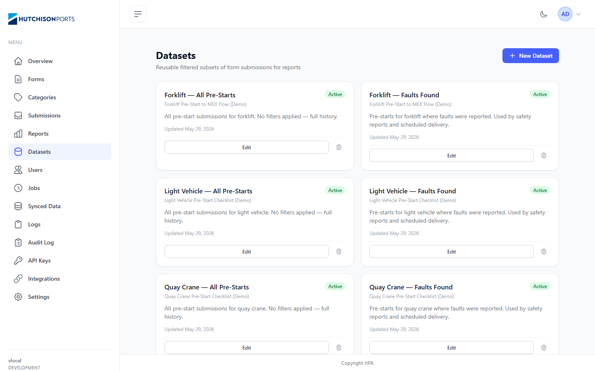
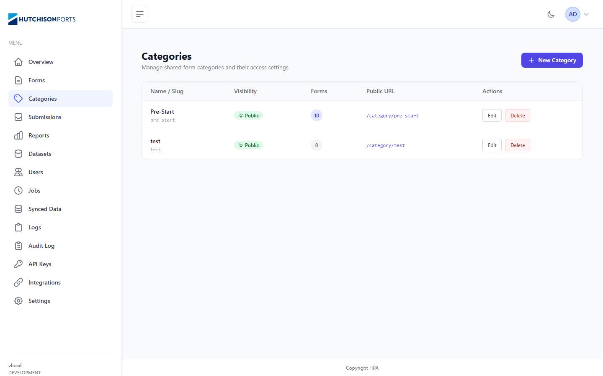
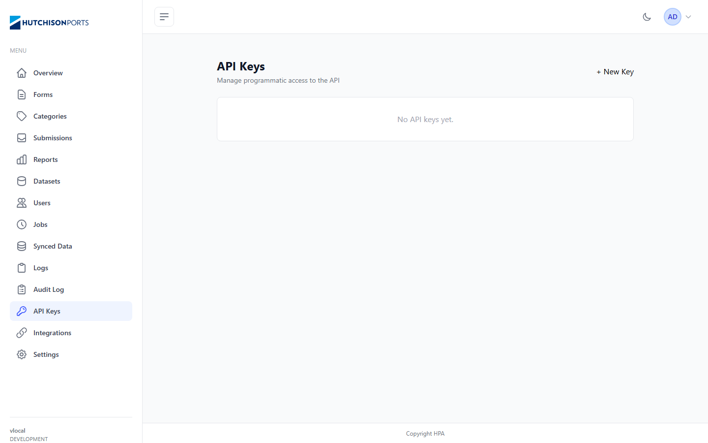
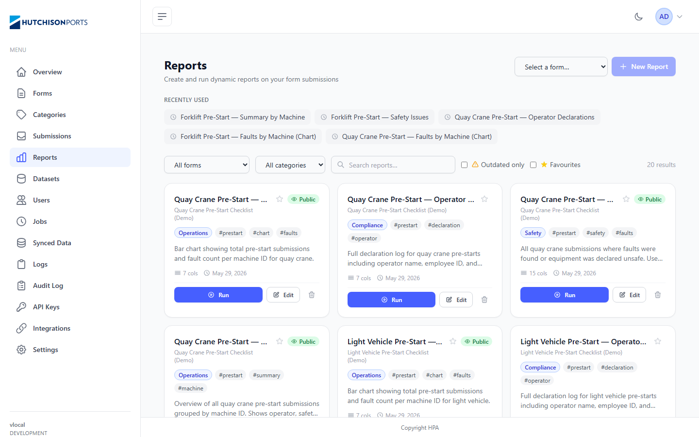
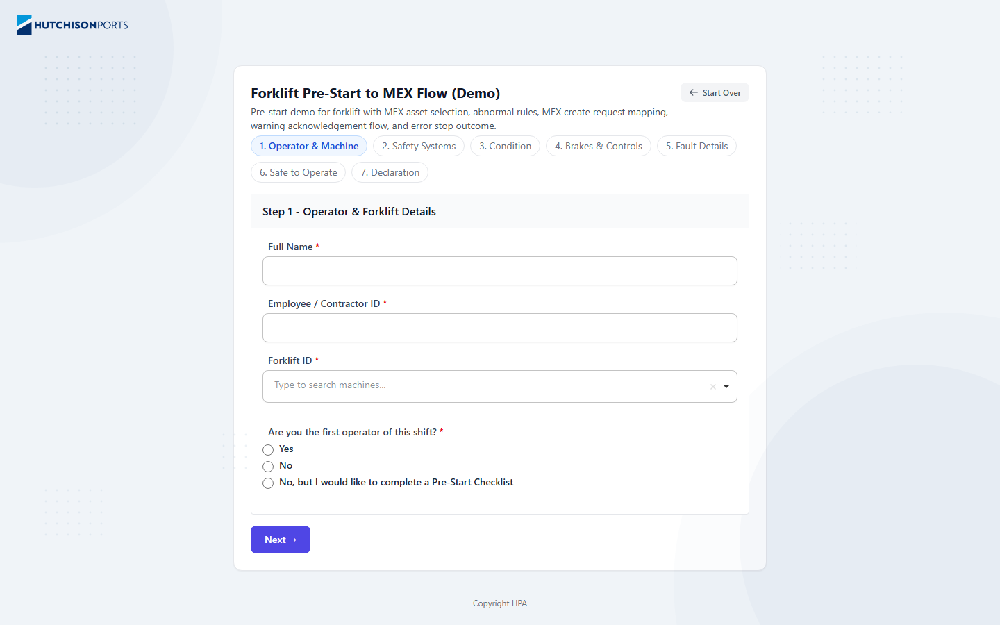
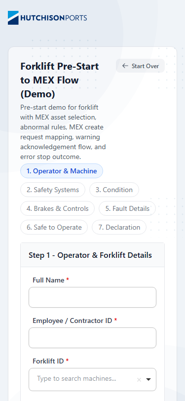
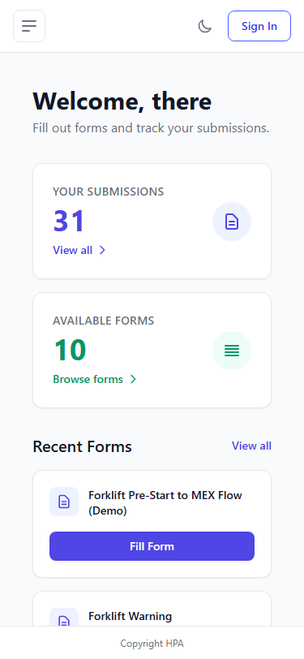

# UI QA Audit — SurveyFlow Admin

Generated: 2026-06-01
Crawler run: 2026-05-31T22:28:50.040Z

---

## Audit Scope

| Item | Value |
|------|-------|
| Base URL | http://localhost:4200 |
| Breakpoints tested | mobile-375, tablet-768, desktop-1024, desktop-1440 |
| Routes discovered | 24 |
| Routes visited | 24 |
| Routes failed/skipped | 0 |
| Axe enabled | Yes |
| Coverage gaps | None — all 24 routes visited successfully |

New this run: `/form-public/15` (public form fill page) added to known routes.

---

## Executive Summary

All 24 routes loaded successfully and the admin shell is visually clean. The most impactful new finding from this run is on the public form page (`/form-public/15`): a critical `aria-allowed-attr` violation on the Choices.js dropdown placeholder, and 9 under-sized touch targets at mobile. Cross-page visual consistency remains the most structurally important issue class: the API Keys primary action is a plain text link while every peer page uses a filled primary button, the API Keys empty state has no icon or CTA, and page content containers have visibly inconsistent widths across admin pages. Accessibility violations total 67 (9 critical, 19 serious) driven by three systemic patterns — missing `<main>` landmark on all 24 pages, unlabelled filter controls, and insufficient colour contrast on `text-gray-400` spans. Mobile (375px) has 24 responsive issues, all tables that lack `overflow-x-auto` wrappers.

---

## Top 10 Fixes in Recommended Order

1. **Add `<main>` landmark to shell layout** — single template change, eliminates `landmark-one-main` + `region` violations across all 24 pages.
2. **Replace `+ New Key` text link with a filled primary button** — closes the most visible cross-page consistency gap.
3. **Fix `aria-allowed-attr` on Choices.js dropdown** (`/form-public/15`) — critical axe violation on the public-facing form used by operators.
4. **Add `aria-label` / `<label>` to unlabelled `<select>` and `<input type="date">` controls** — fixes critical violations on Submissions, Reports, Synced Data, Logs, Audit Log.
5. **Add `aria-label` to unlabelled file inputs on Profile** — fixes 8 critical violations.
6. **Replace `.text-gray-400` with `.text-gray-500`** — resolves serious contrast violations site-wide.
7. **Wrap all `<table>` elements in `<div class="overflow-x-auto">`** — fixes mobile overflow on Forms, Categories, Submissions, Users, Synced Data, Logs.
8. **Replace the API Keys empty state with a structured `EmptyState` component** — add icon, heading, description, CTA.
9. **Standardise destructive action button style** — `border-red-200 bg-red-50 text-red-700` outline everywhere; currently three variants across Forms, admin pages, and the public form.
10. **Increase touch targets to ≥ 44px** — sidebar nav links and table row action buttons at mobile breakpoints.

---

## Cross-page Visual Consistency Findings

### Layout comparison — desktop 1440px



_Datasets — 2-column card grid, white background, content flush to the sidebar boundary, filled `+ New Dataset` primary button top-right, subtitle present below the title._



_Categories — table layout, content aligns consistently with Datasets, filled `+ New Category` primary button top-right, subtitle present._



_API Keys — light-gray background (noticeably different from the white content area on other pages), primary action is a plain `+ New Key` text link (not a button), and the only page content is a plain bordered rectangle reading "No API keys yet." with no icon, description, or CTA._

---

**C-001 — API Keys primary action is a text link while all peer pages use filled buttons**

- Severity: **High**
- Pattern affected: Primary action button style
- Pages compared: Datasets, Categories, Forms, Users vs API Keys
- Evidence: Every admin list page with a create action uses a filled brand-coloured primary button: `+ New Dataset`, `+ New Category`, `+ New Form`, `+ Add User`. The API Keys page uses a plain text `+ New Key` link at the same position. The crawler confirmed `primaryActionLabels: []` for API Keys — the text link was not detected as a button-style action at all. Text links are significantly less discoverable than filled buttons.
- Recommendation: Replace the `+ New Key` text link with `<button class="bg-brand-600 text-white rounded-md px-4 py-2 hover:bg-brand-700">+ New Key</button>` using the same shared primary button component already used on Datasets and Categories.

**Screenshot evidence**


_The `+ New Key` text link (top-right, plain dark text) is visually weak compared to the filled `+ New Dataset` button on the Datasets page._

---

**C-002 — API Keys empty state is structurally weak and inconsistent**

- Severity: **Medium**
- Pattern affected: Empty state component
- Pages compared: API Keys vs all other admin pages
- Evidence: The API Keys empty state is a plain bordered rectangle containing only the text `"No API keys yet."` — no icon, no descriptive sentence, no CTA button. The crawler detected `emptyStateCount: 1` on this page and `emptyStateText: "No API keys yet."` with `primaryActionLabels: []`, confirming there is no action offered inside the empty state.
- Recommendation: Replace with a structured empty state:

  ```
  [🔑 key icon]
  No API keys yet
  API keys let external tools access SurveyFlow data programmatically.
  [+ Create API Key  ← filled primary button]
  ```

  Build a reusable `<app-empty-state [icon]="..." [title]="..." [description]="..." [ctaLabel]="..." (ctaClick)="...">` Angular component and use it here and on any future empty admin page.

**Screenshot evidence**


_The full content area of API Keys shows only a bordered box with "No API keys yet." — no icon, no description, no button._

---

**C-003 — Admin content container background and width are inconsistent**

- Severity: **Medium**
- Pattern affected: Admin page shell / content container
- Pages compared: Datasets (white bg), Categories (white bg), Forms (white bg), API Keys (light-gray bg)
- Evidence: The API Keys page renders with a noticeably lighter gray content background compared to the white content area of Datasets, Categories, and Forms. The content also appears slightly narrower. This suggests the API Keys page uses a different content wrapper or CSS class, not the shared admin shell. The visual mismatch breaks the perception of a unified admin UI.
- Recommendation: Audit the API Keys Angular component template. Ensure it uses the same outer container class (e.g. `<div class="p-6">` or `<app-admin-page-shell>`) as Categories and Datasets. If a shared `AdminPageShell` component doesn't exist, create one with a standard `bg-white px-6 py-6 rounded-lg` wrapper that all admin content pages use.

**Screenshot evidence**


_Categories: content area has white background, consistent with Forms, Users, Datasets._


_API Keys: the background behind the content is noticeably lighter gray, indicating a different wrapper component or CSS class._

---

**C-004 — Card action button hierarchy differs between Datasets and Reports**

- Severity: **Medium**
- Pattern affected: Card-grid page action buttons
- Pages compared: Datasets vs Reports
- Evidence: Both pages use a card-grid layout, but their in-card action buttons differ significantly:
  - **Datasets**: full-width outline `Edit` button + a small trash icon beside it — `Edit` is the only explicit action
  - **Reports**: large filled blue `Run` button + separate outline `Edit` button + trash icon
  The primary action hierarchy is inverted: on Datasets the edit action is primary (outline); on Reports the run action is primary (filled). This is contextually appropriate — running a report is more prominent than editing a dataset config — but it should be explicitly documented in the design system as an intentional exception, not left as an implied inconsistency.
- Recommendation: Document the distinction in the design system: card pages where the primary action is *execution* (Reports: Run) use a filled button; card pages where the primary action is *configuration* (Datasets: Edit) use an outline button. Both should use a consistent trash icon style for destructive actions.

**Screenshot evidence**



_Reports cards: large filled `Run` primary button + outline `Edit` + trash icon._


_Datasets cards: full-width outline `Edit` button only + trash icon. No filled primary action._

---

**C-005 — Page header subtitle present on some admin pages, absent on others**

- Severity: **Low**
- Pattern affected: Page header subtitle
- Pages compared: all admin pages
- Evidence from `consistencyFindings`:
  - **Has subtitle**: Datasets, Categories, API Keys, Reports, Integrations, Settings
  - **No subtitle**: Forms, Users, Submissions, Jobs, Synced Data, Logs, Audit Log, Profile
  No rule governs when subtitles appear. Pages with subtitles gain a quick orientation sentence for first-time users; pages without rely on the title alone.
- Recommendation: Add a one-sentence subtitle to every admin page (preferred), or remove subtitles entirely and rely on page titles. Either is acceptable; inconsistency is not.

---

## Critical / High Priority Findings

**F-001 — Missing `<main>` landmark on all 24 pages**
- Severity: High
- Type: Accessibility
- Affected routes: All 24 pages
- Evidence: `landmark-one-main` (moderate) and `region` (3–105 elements per page) violations on every page
- Recommendation: Add `<main>` wrapper to the root shell component. Single template change; resolves both axe rules globally.

**Screenshot evidence**

Not available — landmark absence is not visually observable.

---

**F-002 — Critical `aria-allowed-attr` on public form Choices.js dropdown**
- Severity: Critical
- Type: Accessibility / Functional
- Affected routes: `/form-public/15`
- Evidence: `aria-allowed-attr` critical violation on `.choices__placeholder` — the Choices.js library applies ARIA attributes (`aria-placeholder`) to an element whose role does not permit them. This is a known Choices.js v9/v10 issue. Screen readers may announce the Forklift ID search field incorrectly or skip it entirely.
- Recommendation: Upgrade Choices.js to the latest version (which fixes this), or apply a post-render attribute correction: remove `aria-placeholder` from the `.choices__inner` element and set it only on the underlying `<input>` if present. Test with a screen reader after the fix.

**Screenshot evidence**



_The "Forklift ID" field uses a Choices.js searchable dropdown. The `.choices__placeholder` element carries an invalid ARIA attribute triggering a critical axe violation._

---

**F-003 — Unlabelled `<select>` controls on filter bars**
- Severity: Critical
- Type: Accessibility
- Affected routes: `/admin/submissions`, `/admin/reports`, `/admin/synced-data`, `/admin/logs`, `/admin/audit-log`
- Evidence: `select-name` critical — 10 selects total (3 on Reports, 3 on Logs, 2 on Synced Data, 1 each on Submissions and Audit Log). Example selectors: `select`, `select[ng-reflect-model=""]`, `.w-48`
- Recommendation: Add `aria-label` or a visually-hidden `<label>` to every bare `<select>`. Use `aria-label="Filter by form"`, `aria-label="Log level"` etc.

**Screenshot evidence**


_The date pickers, form-filter `<select>`, and search input in the Submissions filter bar have no associated labels._

---

**F-004 — Unlabelled date inputs on filter bars**
- Severity: Critical
- Type: Accessibility
- Affected routes: `/admin/submissions`, `/admin/audit-log`
- Evidence: `label` critical — `input[type="date"]:nth-child(1)`, `div:nth-child(3) > input[type="date"]`
- Recommendation: Add `aria-label="From date"` / `aria-label="To date"` to each date range input pair.

**Screenshot evidence**

Not available — same filter bar as F-003; label absence is not visually distinguishable.

---

**F-005 — Unlabelled file inputs on Profile page**
- Severity: Critical
- Type: Accessibility
- Affected routes: `/admin/profile`
- Evidence: `label` critical — `input[type="file"]`, 8 affected elements
- Recommendation: Add `aria-label="Upload profile avatar"` or an explicit `<label>` to the file upload control.

**Screenshot evidence**

Not available from crawler output.

---

**F-006 — Tables overflow viewport at mobile 375px — missing `overflow-x-auto`**
- Severity: High
- Type: Responsive
- Affected routes: `/admin/forms`, `/admin/categories`, `/admin/submissions`, `/admin/users`, `/admin/synced-data`, `/admin/logs`
- Evidence: `table.min-w-full` overflows at 375px on all six pages — right-hand columns (Actions, Anonymous, Public URL) are cut off; row actions are unreachable
- Recommendation: Wrap every `<table>` with `<div class="overflow-x-auto">`.

**Screenshot evidence**


_Forms table clips horizontally at 375px. ANONYMOUS and ACTIONS columns are cut off; Edit/Export/Delete are unreachable._


_Categories table clips at 375px. Public URL and Actions columns are not visible._


_Submissions table clips at 375px. Integration status, date, and Actions columns are cut off._

---

**F-007 — Submissions filter bar overflows at tablet (768px) and desktop (1024px)**
- Severity: High
- Type: Responsive
- Affected routes: `/admin/submissions`
- Evidence: `select.rounded-lg`, `input.rounded-lg`, `button.rounded-lg` overflow viewport at both 768px and 1024px
- Recommendation: Use `flex-wrap gap-2` on the filter row, or convert to a two-row layout at narrower breakpoints.

**Screenshot evidence**

Not available from crawler output.

---

**F-008 — Low colour contrast on `.text-gray-400` spans — site-wide**
- Severity: High (axe `serious`)
- Type: Accessibility
- Affected routes: 16+ pages
- Evidence: `color-contrast` serious on `.text-gray-400 > span`, `h2 > span`, `.mb-4 > span`; worst: Logs (41 elements), Reports (20), Datasets (13)
- Recommendation: Replace `text-gray-400` with `text-gray-500` for all secondary/body text on white or light-gray backgrounds.

**Screenshot evidence**


_The "MENU" sidebar label and card stat subtitles use `text-gray-400` which fails WCAG AA contrast on white backgrounds._

---

**F-009 — 25 console warnings for oversized seed images**
- Severity: High
- Type: Performance / Functional
- Affected routes: `/admin/forms`, `/category/pre-start`
- Evidence: `NG0913` warnings for Forklift.png, Reach Stacker.png, Shuttle.png, Light Vehicle.png, Quay Crane.png — 20 warnings on Forms (5 images × 4 breakpoints), 5 on Category Pre-Start
- Recommendation: Add `width` and `height` attributes to `` tags or use `NgOptimizedImage`. Generate thumbnails server-side for the seed images.

**Screenshot evidence**


_Each table row shows a ~40×40px thumbnail served from a full-resolution seed image, triggering NG0913 on every breakpoint._

---

**F-010 — Public form touch targets too small at mobile 375px**
- Severity: High
- Type: Responsive
- Affected routes: `/form-public/15`
- Evidence: 9 touch targets < 36px — `a:"Start Over"`, `button:"1. Operator & Machine"` (step tab buttons)
- Recommendation: Ensure all step tab buttons and the "Start Over" link have `min-height: 44px`. The form is the primary user-facing page for operators — small targets are a real usability problem on mobile devices.

**Screenshot evidence**



_At 375px the step tab buttons (1–7) wrap to two rows but remain below 44px in height. The "Start Over" link is also undersized._

---

## Cross-page Component Consistency

### Destructive action button styles — now 3 variants

The crawler detected 3 different destructive action styles across 5 pages:

| Page | Style |
|------|-------|
| Forms | `text-red` (plain red text link) |
| Categories, Submissions, Users | `border-red` (outlined red button) |
| Form Public (`/form-public/15`) | flagged but no `destructiveActionStyle` resolved |

Recommendation: Standardise to `border-red-200 bg-red-50 text-red-700 hover:bg-red-100` outlined style everywhere.

### Primary action placement — mostly consistent, one exception

Most admin list pages place primary actions top-right as filled buttons. Exception: **API Keys** uses a plain text link (see C-001).

### Save button location — inconsistent across form pages

| Page | Save placement |
|------|---------------|
| Settings | Top-right |
| Integrations | Top-right |
| Profile | Bottom of form |

Recommendation: Standardise to top-right sticky save for all admin form pages.

### Table density — three variants

| Pages | Density |
|-------|---------|
| Forms, Users | Standard |
| Categories, Synced Data | Loose |
| Submissions, Logs | Compact |

Recommend: one standard density for admin tables; compact only for high-volume read-only views (Logs).

### Table row action labels — mixed text and icon patterns

- Synced Data uses `▸` icon beside text "Details" buttons
- Jobs uses `▶ Run Now` with emoji-style glyph

Recommendation: use text labels only for all table row actions.

### Badge colours — consistent

`bg-green-100` for active/public, `bg-amber-100` for warnings, `bg-red-100` for errors/inactive, `bg-blue-100` for role badges (Users only). No major inconsistency.

### Empty states — only one page, structurally weak

Only API Keys has a detected empty state. It lacks icon, description, and CTA (see C-002). All other pages that may be empty (Audit Log, Datasets with no datasets, etc.) show nothing at all when empty.

---

## Responsive Findings

### Mobile (375px) — 24 issues

| Page | Table overflow | Touch targets < 36px |
|------|--------------|----------------------|
| Login / Public Home | — | 4 each |
| Forms | Yes | 21 |
| Categories | Yes | 7 |
| Submissions | Yes | 51 |
| Reports | — | 82 |
| Datasets | — | 21 |
| Users | Yes | 11 |
| Jobs | — | 9 |
| Synced Data | Yes | 9 |
| Logs | Yes | — |
| Form Public | — | 9 |


_Reports at 375px — filter/tab buttons overflow the viewport; 82 touch targets below minimum size._


_Jobs at 375px — job card action buttons overflow._


_Synced Data at 375px — table and action buttons overflow._


_Users at 375px — table clips, Edit/Delete buttons unreachable._



_Public Home at 375px — "View all" links below minimum touch target height._

### Tablet (768px)

- **Submissions filter bar overflow**: date + select + search + Refresh row exceeds 768px width.
- **Forms table overflow**: `table.min-w-full` overflows within the sidebar layout.

### Desktop (1024px)

- **Submissions filter bar overflow**: same filter row issue persists at 1024px.
- **Forms table overflow**: still overflows at 1024px.

### Large Desktop (1440px)

No layout or overflow issues. All pages render correctly.


_Dashboard at 1440px — layout, sidebar, stat cards, and recent activity all render correctly._

---

## Accessibility Findings

### Critical — Missing form labels

| Rule | Pages | Count | Example selector |
|------|-------|-------|-----------------|
| `aria-allowed-attr` | `/form-public/15` | 1 | `.choices__placeholder` |
| `select-name` | Submissions, Reports, Synced Data, Logs, Audit Log | 10 | `select[ng-reflect-model=""]` |
| `label` | Submissions, Audit Log | 4 | `input[type="date"]:nth-child(1)` |
| `label` | Profile | 8 | `input[type="file"]` |

Fix: Add `aria-label` or `<label>` to all bare `<select>` and `<input>` in filter bars and the profile avatar uploader. Fix `aria-allowed-attr` by upgrading Choices.js.

### Serious — Colour contrast (all pages)

| Worst affected | Elements |
|---------------|---------|
| Logs (41), Reports (20), Datasets (13), Admin/Dashboard (8) | `h2 > span`, `.text-gray-400 > span`, `.mb-4 > span` |

Replace `text-gray-400` with `text-gray-500` or darker for secondary/body text.

### Moderate — Missing `<main>` landmark (all 24 pages)

Adding `<main>` to the root shell template resolves `landmark-one-main` and `region` globally.

### Moderate — Heading order (Datasets)

Rule `heading-order` on `/admin/datasets` — card titles skip a heading level. Ensure dataset card headings follow `h1` in sequence.

### Moderate — Missing `<h1>` on Category Pre-Start public page

Rule `page-has-heading-one` — `/category/pre-start` has no `<h1>`. Add a visible or `sr-only` `<h1>` with the category name.

### Minor — Empty table header (Synced Data)

Rule `empty-table-header` — the Actions column `<th>` (`.w-20:nth-child(6)`) has no text. Add `scope="col"` and `aria-label="Actions"`.

---

## Page-Specific Findings

### `/form-public/15` — Public form fill page (new)

- Critical `aria-allowed-attr` on Choices.js `.choices__placeholder` element (F-002).
- Serious colour contrast on `.choices__placeholder` text.
- 9 touch targets < 36px at mobile — step tabs and "Start Over" link (F-010).
- The form itself renders correctly at desktop 1440px with a clean card layout, progress tabs, and clear field labels.
- No console errors specific to this page.

### `/admin/api-keys` — API Keys page

- Primary action is a text link, not a button (C-001 — High).
- Empty state has no icon, description, or CTA (C-002 — Medium).
- Colour contrast violation on `h2 > span` (serious).

### `/admin/logs` — Log Viewer

- 41 colour contrast violations — most of any single page.
- No primary action detected; appropriate for a read-only view but consider an "Export" button.

### `/admin/reports` — Reports page

- 20 colour contrast violations on `.mb-4 > span` (report card subtitles).
- 3 unlabelled `<select>` controls in the chart toolbar.
- 82 touch targets below minimum size at mobile.

### `/category/pre-start` — Public category page

- No `<h1>` heading (`page-has-heading-one` axe violation; crawler detected `heading: null`).
- 5 NG0913 console warnings for oversized seed images.
- No breadcrumb or navigation back to home listing.

---

## Design System Recommendations

### Buttons

| Variant | Classes |
|---------|---------|
| Primary | `bg-brand-600 text-white hover:bg-brand-700 rounded-md px-4 py-2 min-h-[44px]` |
| Secondary | `border border-gray-300 bg-white text-gray-700 hover:bg-gray-50 rounded-md px-4 py-2 min-h-[44px]` |
| Destructive | `border border-red-200 bg-red-50 text-red-700 hover:bg-red-100 rounded-md px-4 py-2 min-h-[44px]` |
| Ghost / icon | `text-gray-500 hover:text-gray-700 p-2 rounded min-h-[44px]` + `aria-label` required |

All buttons must have `min-h-[44px]` for WCAG 2.5.5 touch target compliance.

### Tables

- Wrap every `<table>` in `<div class="overflow-x-auto">`.
- Use `class="min-w-[640px]"` on the `<table>` to preserve column readability.
- Every `<th>` must have `scope="col"` and accessible text.

### Forms

- Every `<input>`, `<select>`, `<textarea>` must have a visible `<label>` or `sr-only` label.
- Date range pairs: `aria-label="From date"` / `aria-label="To date"`.
- File uploads: `aria-label="Upload profile avatar"` or explicit `<label>`.

### Colour

- Secondary / body text: `text-gray-500` minimum (not `text-gray-400`) on light backgrounds.

### Badges

| Intent | Classes |
|--------|---------|
| Active / public | `bg-green-100 text-green-800` |
| Warning | `bg-amber-100 text-amber-800` |
| Error / inactive | `bg-red-100 text-red-800` |
| Neutral | `bg-gray-100 text-gray-700` |

### Empty states

Build `<app-empty-state [icon] [title] [description] [ctaLabel] (ctaClick)>` and use on API Keys immediately. Prepare for Datasets (no datasets), Audit Log, and Reports (no reports).

### Semantic landmarks

```html
<nav aria-label="Main navigation"><!-- sidebar --></nav>
<main><!-- page content --></main>
```

Single shell template change; eliminates `landmark-one-main` and `region` violations across all 24 pages.

### Admin page shell

Create a shared `AdminPageShell` or `PageContainer` wrapper with consistent `bg-white px-6 py-6` applied to all admin content pages. This fixes the API Keys background inconsistency (C-003) and prevents future divergence.

### Save button location

Standardise to top-right sticky save for all admin form pages (Settings, Integrations, Profile).

---

## Prioritised Fix Plan

### Quick wins (< 1 hour each)

- Add `<main>` wrapper to shell component template.
- Replace `text-gray-400` with `text-gray-500` in card subtitles and sidebar labels.
- Add `aria-label` to all `<select>` elements in filter bars (5 pages, ~10 selects).
- Add `aria-label` to `input[type="date"]` filter inputs (Submissions, Audit Log).
- Add `scope="col"` and `aria-label="Actions"` to the empty `<th>` on Synced Data.
- Add `<h1>` to `/category/pre-start` public page.
- Replace `+ New Key` text link with a filled primary button on API Keys.

### High-impact fixes (1–4 hours each)

- **Fix `aria-allowed-attr` on Choices.js** — upgrade library or apply post-render attribute correction on `/form-public/15`.
- **Table `overflow-x-auto` wrappers** — 6 tables: Forms, Categories, Submissions, Users, Synced Data, Logs.
- **Touch target sizing** — `min-h-[44px]` on sidebar nav links, table row action buttons, form step tabs.
- **Submissions filter bar responsive layout** — `flex-wrap gap-2` on the 4-control filter row.
- **Standardise destructive button style** — update Forms page to `border-red` outlined style.
- **Add structured empty state to API Keys** — icon + heading + description + CTA button.
- **Apply shared `AdminPageShell` wrapper to API Keys** — fixes background and container inconsistency.

### Larger redesign items

- **Image optimisation** — server-side thumbnails or `NgOptimizedImage` to eliminate NG0913 warnings.
- **Reports page mobile layout** — full responsive redesign; 82 touch targets below minimum.
- **Empty state system** — build `<app-empty-state>` and retrofit to API Keys, Datasets, Audit Log, Reports.
- **Admin page subtitle consistency** — decide: all pages have subtitles, or none do.
- **Responsive table reflow** — card-based reflow for Forms and Users at 375px beyond just `overflow-x-auto`.

---

## Coverage Gaps

All 24 discovered routes were visited successfully. No gaps in this run.

**Dynamic routes not yet covered** — require seeded IDs:

| Route pattern | Description |
|---------------|-------------|
| `/admin/forms/:id/edit` | Form editor |
| `/admin/forms/:id/view` | Form viewer / preview |
| `/admin/submissions/:id` | Submission detail |
| `/admin/reports/:id` | Report detail / chart view |
| `/form-public/:id` (other IDs) | Other public forms beyond seed ID 15 |

To cover these in a future run, seed known IDs into `ui-qa-config.ts` as parameterised known routes.
